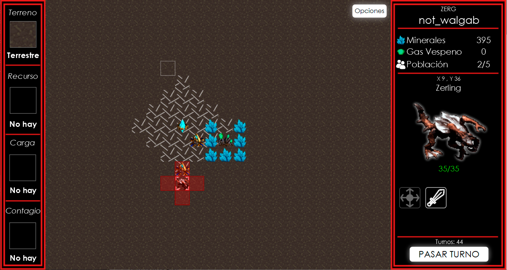

<p align="center">
    
</p>

 [](https://codecov.io/gh/walgab/AlgoStar) [](https://github.com/walgab/AlgoStar#readme)

# Trabajo Práctico 2 - Algoritmos y Programación 3: **AlgoStar**

Trabajo Práctico número 2 de la materia _Algoritmos y Programación III_ [75.07 - 95.02] de FIUBA.

La documentación, los nombres de variables y los nombres de funciones están escritos principalmente en español ya que es el idioma en el que se dicta el curso.

## Breve resumen

El trabajo práctico consiste en desarrollar un juego por turnos inspirado en el famoso videojuego Starcraft (de ahí el nombre Algo (Algoritmos) - Star (Starcraft)), el cual se centra en la guerra entre imperios, la estrategia y se basa en la construcción y administración de un imperio. Este consta de un modelo de clases, sonidos e interfaz gráfica, acompañados de una suite de pruebas unitarias e integrales (casos de uso del juego). La implementación fue escrita en el lenguaje de programación de tipado estático Java, versión 11.0.7. Para el desarrollo del modelo de la solución se aplicaron principios de programación orientada a objetos y se trabajó con las técnicas de TDD (Test Driven Development) y CI (Continuous Integration), también se aplicaron patrones de diseño donde se consideró conveniente para resolver un problema específico.

## Grupo 5

* **Integrante 1** - [Iván Azuaje Ayala](https://github.com/iazuaje)
* **Integrante 2** - [Gabriel Zitelli](https://github.com/gabrielzitelli)
* **Integrante 3** - [Pedro Etchegoyen](https://github.com/PedroEtche)
* **Integrante 4** - [Walter Gabriel Diem](https://github.com/walgab)
* **Integrante 5** - [Benzaquen Ezequiel](https://github.com/ezebenza2000)

**Corrector:** [Pablo Rodríguez Massuh](https://github.com/xpitr256)

## Aplicación

La versión más reciente de la aplicación puede encontrarse en la pestaña [releases](https://github.com/walgab/AlgoStar/releases/latest) y ejecutarse en Linux, Windows o Mac de esta forma:

```bash
$ java -jar <archivo.jar>
```

## Desarrollo

Aquellos que deseen colaborar con el proyecto pueden consultar la [guía de desarrollo](./docs/Desarrollo.md).

## Informe

El informe se puede encontrar en el siguiente [enlace](./docs/Informe_TP2_AlgoStar_Algoritmos_III_Suarez.pdf).

## Licencia

Este repositorio se encuentra bajo la Licencia MIT.

## Imágenes


