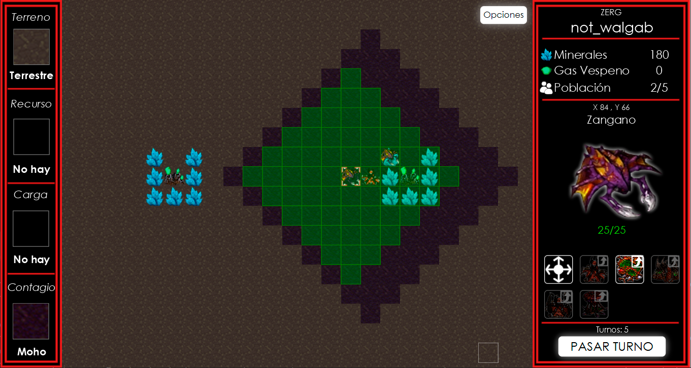

<p align="center">
    
</p>

<div align="center">

 [](https://codecov.io/gh/walgab/AlgoStar) [](https://github.com/walgab/AlgoStar/blob/master/README.es.md)

</div>

# Project 2 - Algorithms and Programming 3: **AlgoStar**

Project number 2 for the subject _Algorithms and Programming 3_ [75.07 - 95.02] Suarez's course 2Q2022 at the Faculty of Engineering of the University of Buenos Aires (FIUBA).

The documentation, variable names and functions names are mostly written in Spanish as it is the language the course is teached on.

## Brief summary

This project consists of developing a turn-based game inspired by the famous video game Starcraft (hence the name Algo (Algorithms) - Star (Starcraft)). The game focuses on the war between empires, the clever use of strategy, and it is based on the construction and management of an empire. It consists of an OOP class model, sounds and a graphical interface, accompanied by a suite of unit and integration tests (game use cases). The implementation was written in the statically typed programming language Java, version 11.0.7. For the development of the solution model, object-oriented programming principles were applied and we worked with TDD (Test Driven Development) and CI (Continuous Integration) techniques, design patterns were also applied where deemed appropriate to solve a specific problem.

## Group #5

* **Participant 1** - [Iván Azuaje Ayala](https://github.com/iazuaje)
* **Participant 2** - [Gabriel Zitelli](https://github.com/gabrielzitelli)
* **Participant 3** - [Pedro Etchegoyen](https://github.com/PedroEtche)
* **Participant 4** - [Walter Gabriel Diem](https://github.com/walgab)
* **Participant 5** - [Benzaquen Ezequiel](https://github.com/ezebenza2000)

**Evaluator:** [Pablo Rodríguez Massuh](https://github.com/xpitr256)

## Software used

| Software | Version |
| -------- | ------- |
| Java SDK | 11.0.7  |
| JavaFX   | 19      |
| JUnit    | 5.4     |
| Maven    | 3.8.6   |


## App

The most recent version of the app can be found in the [releases](https://github.com/walgab/AlgoStar/releases/latest) tab and the `jar` file can be executed in Linux, Windows or Mac by running the next command:

```bash
$ java -jar <filename.jar>
```

For Windows users it is also provided a `.exe` executable file, also in the [releases](https://github.com/walgab/AlgoStar/releases/latest) tab, that serves as a self contained version of the game, meaning you do not need a JRE (Java Runtime Environment) to run this file, it comes with it included. You just have to run it and it is playable.

_Warning_: The executable file may trigger a warning from your antivirus software. This is a known issue and it is caused by the fact that the executable is signed with a self-signed certificate. This does not mean that the file is unsafe or malicious. If you wish to proceed with running the executable, you may need to add an exception for the file in your antivirus software or disable the antivirus temporarily. We recommend only disabling the antivirus temporarily and after running the file, please remember to turn it on again. As a general rule, it is advised to only run executable files from sources you trust. I apologize for any inconvenience this may cause. If you have any concerns or questions, please reach out.

This Windows executable was made by creating a launcher for the `.jar` file with [Launch4J](https://launch4j.sourceforge.net/) and linking it with the corresponding JRE (version 11.0.18). Then this was bundled in a SFX (Self-Extracting Archive) file with [7-Zip](https://www.7-zip.org/) and [7-Zip SFX Maker](https://sourceforge.net/projects/sfx-maker/), resulting in a `.exe` file that extracts the JRE and the game itself to a temporary folder (in the Windows `TEMP` directory) so it can be run.

## Development

Those interested in colaborating in this project can read the [development guide](./docs/Desarrollo.md).

## Project Report

The project report can be found in the next [link](./docs/Informe_TP2_AlgoStar_Algoritmos_III_Suarez.pdf).

## License

This project is licensed under the terms of the MIT license.

## Images





